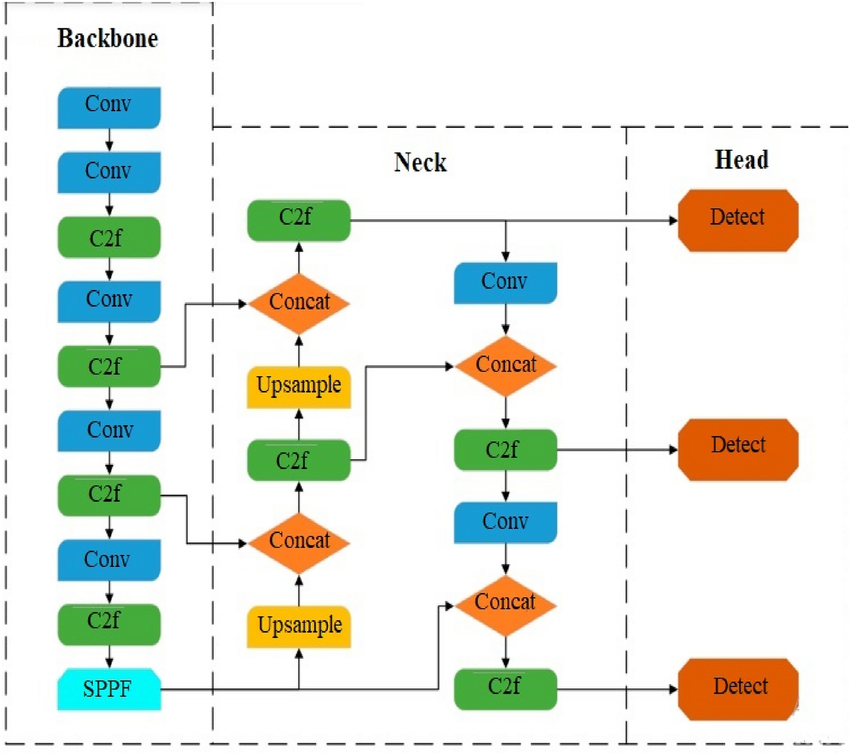

# Trained Model

This folder contains the trained YOLOv8 model used for object detection.

## Model Link

The model is available on Google Drive at the following link:

[Google Drive - Trained YOLOv8 Model](https://drive.google.com/file/d/1CZ85BrGxaIAVTDr2OdtwLUGFD3swqF8I/view?usp=sharing)

---

## Model Details

- Model type: YOLOv8  
- Dataset: Custom dataset from Roboflow (👉 [Download Dataset from Roboflow](https://app.roboflow.com/foodobjectdetection-gbrbd/foodobjectdetectiondataset) | See DATASET.MD for more details) 
- Last training date: June 14, 2025  
- Model version: v.1.4  

---

## Model Architecture

### YOLOv8 Architecture – Key Components

- **Conv**  
  Standard convolutional layer used to extract features from the input image using kernels, stride, and padding.

- **C2f**  
  "Cross Stage Partial with 2 convolution blocks" – an efficient variant of CSP blocks that reduces the number of parameters while maintaining performance.

- **Concat**  
  Concatenates tensors from different layers to combine multi-scale feature information (commonly used in encoder-decoder skip connections).

- **Upsample**  
  Increases the spatial resolution of feature maps (usually via nearest-neighbor interpolation) to enable fusion with higher-resolution features.

- **Detect**  
  The final detection head that predicts bounding box coordinates, object classes, and confidence scores for each detected object.

 
*Visual representation of the model architecture.*

If you have any questions, feel free to reach out!
